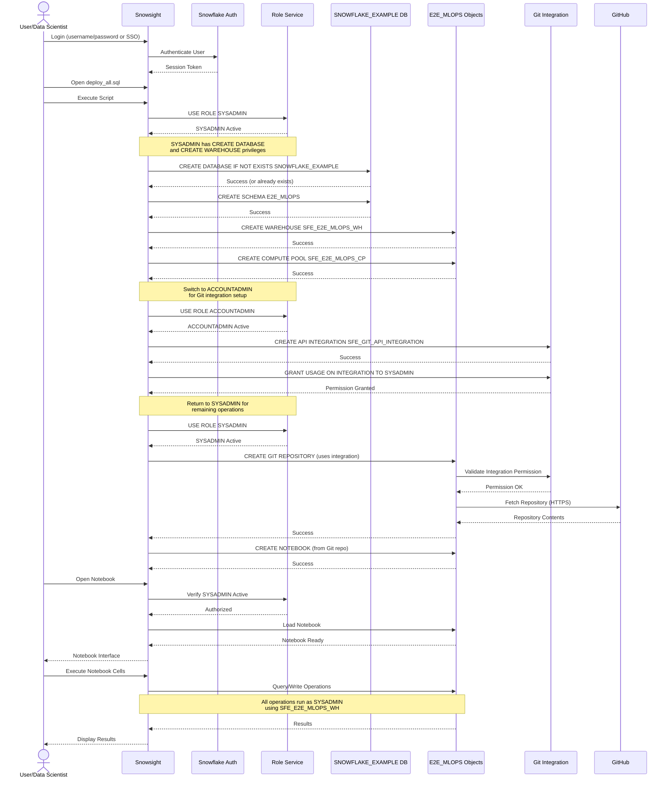

# Auth Flow - End-to-End ML Pipeline Demo
Author: SE Community
Last Updated: 2024-12-16
Expires: 2025-01-15
Status: Reference Implementation


Reference Implementation: This code demonstrates production-grade architectural patterns and best practices. Review and customize security, networking, and logic for your organization's specific requirements before deployment.

## Overview
This diagram shows the authentication and authorization flow for the E2E ML pipeline, demonstrating how SYSADMIN role is used for all operations and how permissions are granted for Git integration access.



## Component Descriptions

### Authentication Layer
- **Snowflake Auth Service**
  - Purpose: Authenticate users via username/password, SSO, or federated auth
  - Technology: Snowflake authentication service
  - Methods: Native, SAML, OAuth, Okta, ADFS
  - Session: Tokens valid for configured session timeout
  
### Authorization Layer
- **Role Service**
  - Purpose: Manage role context and permission checks
  - Roles Used:
    - **SYSADMIN**: Primary role for all demo operations
    - **ACCOUNTADMIN**: Only for creating Git API integration
  - Security Model: Role-based access control (RBAC)

### Privileged Operations

#### SYSADMIN Role Permissions
```sql
-- Database Operations
CREATE DATABASE IF NOT EXISTS
CREATE SCHEMA IF NOT EXISTS

-- Compute Operations
CREATE WAREHOUSE (account-level)
CREATE COMPUTE POOL (account-level)

-- Object Operations
CREATE TABLE
CREATE NOTEBOOK
CREATE GIT REPOSITORY (requires integration permission)
CREATE OR REPLACE MODEL
CREATE MODEL MONITOR

-- Usage Operations
USE WAREHOUSE
USE DATABASE
USE SCHEMA
```

#### ACCOUNTADMIN Role Permissions (Limited Use)
```sql
-- Integration Operations (one-time setup)
CREATE API INTEGRATION SFE_GIT_API_INTEGRATION
GRANT USAGE ON INTEGRATION ... TO SYSADMIN
```

### Git Integration Authentication
- **SFE_GIT_API_INTEGRATION**
  - Purpose: Authenticate Snowflake to GitHub for repository access
  - Type: API Integration (git_https_api)
  - Credentials: None required (public repository)
  - Access: Read-only
  - Scope: Allowed prefixes (https://github.com/sfc-gh-miwhitaker)
  - Security: ACCOUNTADMIN creates, SYSADMIN uses

### Object Ownership
All objects created by SYSADMIN:
```
SNOWFLAKE_EXAMPLE (Database)
├── E2E_MLOPS (Schema)
    ├── MORTGAGE_LENDING_DEMO_DATA (Table)
    ├── TRAIN_DEPLOY_MONITOR_ML (Notebook)
    ├── GIT_REPO_E2E_MLOPS (Git Repository)
    ├── MORTGAGE_LENDING_MLOPS_0 (Model Registry)
    └── Model Monitors (Monitoring Objects)

Account-Level Objects:
├── SFE_E2E_MLOPS_WH (Warehouse)
├── SFE_E2E_MLOPS_CP (Compute Pool)
└── SFE_GIT_API_INTEGRATION (API Integration - ACCOUNTADMIN)
```

### Permission Flow

1. **Initial Setup**
   - User authenticates to Snowflake
   - User assumes SYSADMIN role
   - SYSADMIN creates database, schema, warehouse, compute pool

2. **Git Integration Setup**
   - Switch to ACCOUNTADMIN (required for CREATE INTEGRATION)
   - Create SFE_GIT_API_INTEGRATION
   - Grant USAGE to SYSADMIN
   - Switch back to SYSADMIN

3. **Repository and Notebook Creation**
   - SYSADMIN creates Git repository (uses integration)
   - Snowflake authenticates to GitHub via integration
   - Fetch repository contents
   - Create notebook from repository

4. **Runtime Execution**
   - User opens notebook (SYSADMIN permission check)
   - Notebook executes on SFE_E2E_MLOPS_CP (SYSADMIN-owned)
   - Queries use SFE_E2E_MLOPS_WH (SYSADMIN-owned)
   - All data access controlled by SYSADMIN object ownership

### Security Boundaries

| Boundary | Control | Implementation |
|----------|---------|----------------|
| User Authentication | Snowflake Auth | Username/password or SSO |
| Role Authorization | RBAC | SYSADMIN role required |
| Object Access | Ownership | SYSADMIN owns all objects |
| Git Access | API Integration | ACCOUNTADMIN creates, SYSADMIN uses |
| Network | HTTPS/TLS | All external connections encrypted |

### Access Control List (Effective Permissions)

```
SYSADMIN Role:
  ✅ CREATE DATABASE, SCHEMA, WAREHOUSE, COMPUTE POOL
  ✅ CREATE TABLE, VIEW, NOTEBOOK
  ✅ CREATE GIT REPOSITORY (with integration permission)
  ✅ CREATE MODEL, MODEL MONITOR
  ✅ USAGE on SFE_GIT_API_INTEGRATION (explicitly granted)
  ❌ CREATE INTEGRATION (requires ACCOUNTADMIN)

ACCOUNTADMIN Role:
  ✅ All SYSADMIN permissions
  ✅ CREATE INTEGRATION
  ✅ GRANT permissions to other roles
```

## Best Practices

1. **Principle of Least Privilege**
   - Use SYSADMIN for all operations except integration creation
   - Only escalate to ACCOUNTADMIN when required
   - Immediately return to SYSADMIN after privileged operation

2. **Role Segregation**
   - ACCOUNTADMIN: Setup integrations only
   - SYSADMIN: All demo operations and object management
   - User roles: Read-only access (not covered in this demo)

3. **Object Ownership**
   - All demo objects owned by SYSADMIN
   - Clear cleanup path (DROP CASCADE from SYSADMIN)
   - No orphaned objects

4. **Integration Security**
   - API integrations require ACCOUNTADMIN
   - Grant USAGE to SYSADMIN explicitly
   - Use allowed_prefixes to restrict access scope

## Change History
See `.cursor/DIAGRAM_CHANGELOG.md` for version history.

