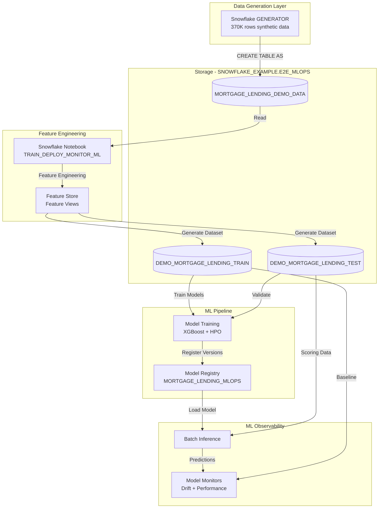

# Data Flow - End-to-End ML Pipeline Demo
Author: SE Community
Last Updated: 2024-12-16
Expires: 2025-01-15
Status: Reference Implementation

Reference Implementation: This code demonstrates production-grade architectural patterns and best practices. Review and customize security, networking, and logic for your organization's specific requirements before deployment.

## Overview
This diagram shows how synthetic mortgage lending data flows from generation through feature engineering, model training, registry, and monitoring within Snowflake's E2E ML pipeline.

## Component Descriptions

### Data Generation Layer
- **Snowflake GENERATOR**: Built-in table function generates 370,000 synthetic mortgage records
  - Technology: Snowflake GENERATOR, UNIFORM, NORMAL, RANDOM functions
  - Location: `deploy_all.sql` lines 57-101
  - Deps: None (fully self-contained)

### Storage Layer (SNOWFLAKE_EXAMPLE.E2E_MLOPS)
- **MORTGAGE_LENDING_DEMO_DATA**: Raw synthetic data table
  - Technology: Snowflake table
  - Columns: LOAN_ID, TS, LOAN_TYPE_NAME, LOAN_PURPOSE_NAME, APPLICANT_INCOME_000S, LOAN_AMOUNT_000S, COUNTY_NAME, MORTGAGERESPONSE
  - Deps: Generated by deploy_all.sql
  
- **DEMO_MORTGAGE_LENDING_TRAIN/TEST**: Train/test split tables with predictions
  - Technology: Snowflake tables with schema evolution
  - Location: Created by notebook during inference
  - Deps: Feature Store datasets

### Feature Engineering
- **Snowflake Notebook**: Interactive ML development environment
  - Technology: Snowflake Notebook (Jupyter-compatible)
  - Location: TRAIN_DEPLOY_MONITOR_ML
  - Deps: SFE_E2E_MLOPS_WH warehouse, SFE_E2E_MLOPS_CP compute pool
  
- **Feature Store**: Manages feature definitions and lineage
  - Technology: Snowflake ML Feature Store
  - Features: TIMESTAMP, MONTH, DAY_OF_YEAR, DOTW, LOAN_AMOUNT, INCOME, INCOME_LOAN_RATIO, MEAN_COUNTY_INCOME, HIGH_INCOME_FLAG, AVG_THIRTY_DAY_LOAN_AMOUNT
  - Location: MORTGAGE_FEATURE_VIEW
  - Deps: MORTGAGE_LENDING_DEMO_DATA

### ML Pipeline
- **Model Training**: Trains baseline and HPO-optimized XGBoost models
  - Technology: Snowflake ML Modeling, XGBoost, distributed HPO
  - Models: XGB_BASE (baseline), XGB_OPTIMIZED (HPO-tuned)
  - Location: Notebook cells 29-52
  - Deps: Feature Store datasets, SFE_E2E_MLOPS_WH
  
- **Model Registry**: Version control and metadata tracking for models
  - Technology: Snowflake Model Registry
  - Model Name: MORTGAGE_LENDING_MLOPS_0
  - Versions: XGB_BASE, XGB_OPTIMIZED
  - Location: SNOWFLAKE_EXAMPLE.E2E_MLOPS
  - Deps: Trained models

### ML Observability
- **Batch Inference**: Score test data with registered models
  - Technology: Stored procedure (model_inference_sproc)
  - Location: Notebook cells 64-69
  - Deps: Model Registry, test data
  
- **Model Monitors**: Track performance and drift over time
  - Technology: Snowflake Model Monitoring
  - Monitors: MORTGAGE_LENDING_BASE_MODEL_MONITOR, MORTGAGE_LENDING_OPTIMIZED_MODEL_MONITOR
  - Metrics: F1, Precision, Recall, Drift (DIFFERENCE_OF_MEANS)
  - Location: SNOWFLAKE_EXAMPLE.E2E_MLOPS
  - Deps: Baseline (train) and source (test) tables with predictions

## Data Transformations

| Stage | Input | Transformation | Output |
|-------|-------|----------------|--------|
| Generation | None | GENERATOR + random functions | MORTGAGE_LENDING_DEMO_DATA (370K rows) |
| Feature Engineering | Raw data | Window functions, calculations, timestamp features | Feature Store views |
| Dataset Creation | Feature views | Join spine + features, split train/test | TRAIN/TEST tables |
| Training | Train dataset | XGBoost fit + HPO | Model artifacts in Registry |
| Inference | Test dataset + Model | Model.predict() | Predictions added to tables |
| Monitoring | Predictions + Actuals | Drift + performance metrics | Monitor dashboards |

## Change History
See `.cursor/DIAGRAM_CHANGELOG.md` for version history.

