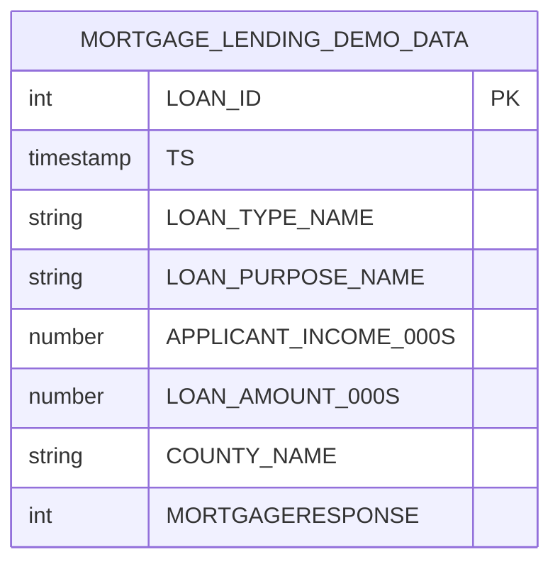

# Data Model - End-to-End ML Pipeline Demo
Author: SE Community
Last Updated: 2025-12-16
Expires: 2026-02-05
Status: Reference Implementation

Reference Implementation: This code demonstrates production-grade architectural patterns and best practices. Review and customize security, networking, and logic for your organization's specific requirements before deployment.

## Overview
This data model captures the synthetic mortgage lending dataset generated directly in Snowflake for the demo. It includes loan identifiers, timestamps, loan type and purpose, applicant income, loan amounts, county context, and the mortgage approval response label used for downstream ML training and monitoring.

## Component Descriptions
- Synthetic Data Table
  - Purpose: Stores generated mortgage lending records for feature engineering and modeling
  - Technology: Snowflake table
  - Location: SNOWFLAKE_EXAMPLE.E2E_MLOPS.MORTGAGE_LENDING_DEMO_DATA
  - Deps: Generated by `deploy_all.sql` using SYSADMIN and Snowflake generators
- Compute Warehouse
  - Purpose: Executes queries, data generation, and notebook workloads
  - Technology: Snowflake warehouse `SFE_E2E_MLOPS_WH`
  - Location: Account-level object
  - Deps: Provisioned in `deploy_all.sql`
- Notebook
  - Purpose: Runs the end-to-end ML workflow over the synthetic data
  - Technology: Snowflake Notebook `TRAIN_DEPLOY_MONITOR_ML`
  - Location: SNOWFLAKE_EXAMPLE.E2E_MLOPS
  - Deps: Uses `MORTGAGE_LENDING_DEMO_DATA`, warehouse `SFE_E2E_MLOPS_WH`

## Change History
See git history for changes.
