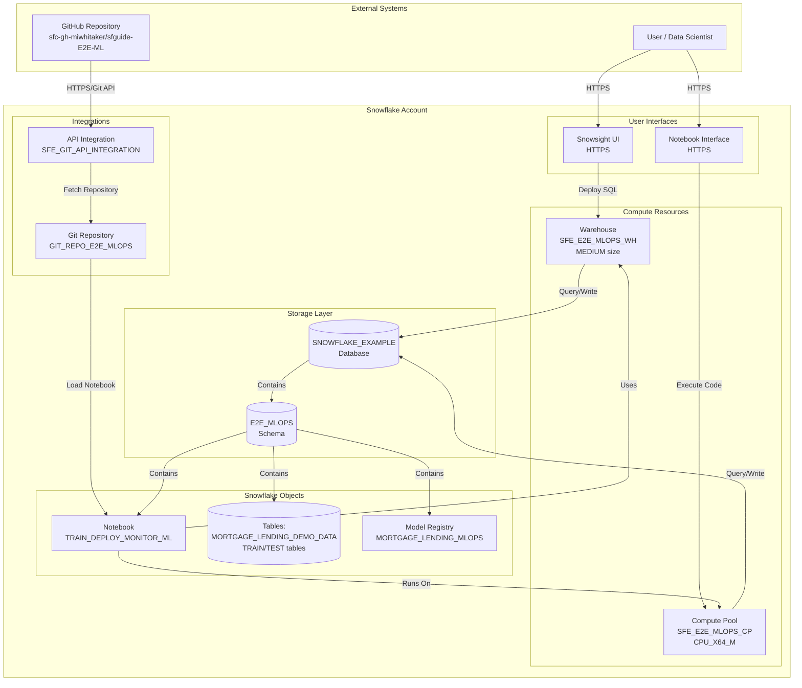

# Network Flow - End-to-End ML Pipeline Demo
Author: SE Community
Last Updated: 2024-12-16
Expires: 2025-01-15
Status: Reference Implementation

Reference Implementation: This code demonstrates production-grade architectural patterns and best practices. Review and customize security, networking, and logic for your organization's specific requirements before deployment.

## Overview
This diagram shows the network architecture and connectivity for the E2E ML pipeline, including external Git integration, Snowflake account resources, compute infrastructure, and user access patterns.

## Component Descriptions

### External Systems
- **User / Data Scientist**
  - Purpose: Deploy infrastructure, run notebook, analyze results
  - Technology: Web browser (HTTPS)
  - Location: Remote client
  - Access: SYSADMIN role required
  
- **GitHub Repository**
  - Purpose: Version control for notebook and deployment scripts
  - Technology: GitHub (Git over HTTPS)
  - URL: https://github.com/sfc-gh-miwhitaker/sfguide-E2E-ML
  - Protocol: HTTPS port 443

### User Interfaces
- **Snowsight UI**
  - Purpose: Execute deploy_all.sql, view objects, manage resources
  - Technology: Snowflake web UI
  - Protocol: HTTPS
  - Authentication: Snowflake credentials + SYSADMIN role
  
- **Notebook Interface**
  - Purpose: Interactive ML development and execution
  - Technology: Jupyter-compatible notebook in Snowflake
  - Protocol: HTTPS
  - Location: Accessed through Snowsight

### Compute Resources
- **Warehouse (SFE_E2E_MLOPS_WH)**
  - Purpose: Execute SQL queries, DDL operations, data generation
  - Technology: Snowflake virtual warehouse
  - Size: MEDIUM
  - Configuration: AUTO_SUSPEND=60s, AUTO_RESUME=TRUE
  - Network: Internal Snowflake compute
  
- **Compute Pool (SFE_E2E_MLOPS_CP)**
  - Purpose: Run notebook runtime and SPCS workloads
  - Technology: Snowflake Compute Pool
  - Size: 1 node, CPU_X64_M instance family
  - Configuration: AUTO_SUSPEND=300s, AUTO_RESUME=TRUE
  - Network: Internal Snowflake container runtime

### Integrations
- **API Integration (SFE_GIT_API_INTEGRATION)**
  - Purpose: Authenticate with GitHub for repository access
  - Technology: Snowflake Git API Integration
  - Protocol: HTTPS
  - Allowed Prefixes: https://github.com/sfc-gh-miwhitaker
  - Permissions: Read-only access to public repositories
  
- **Git Repository (GIT_REPO_E2E_MLOPS)**
  - Purpose: Stage for notebook and code artifacts
  - Technology: Snowflake Git Repository object
  - Origin: https://github.com/sfc-gh-miwhitaker/sfguide-E2E-ML
  - Access Pattern: Fetch on demand via ALTER REPOSITORY FETCH

### Storage Layer
- **SNOWFLAKE_EXAMPLE Database**
  - Purpose: Shared database for all demo projects
  - Technology: Snowflake database
  - Owner: SYSADMIN
  - Location: Snowflake account internal storage
  
- **E2E_MLOPS Schema**
  - Purpose: Project-specific namespace for all objects
  - Technology: Snowflake schema
  - Owner: SYSADMIN
  - Contains: Tables, notebook, models, monitors

### Snowflake Objects
- **Notebook (TRAIN_DEPLOY_MONITOR_ML)**
  - Purpose: Execute end-to-end ML workflow
  - Runtime: SYSTEM$BASIC_RUNTIME (Python 3.10, ML libraries)
  - Query Warehouse: SFE_E2E_MLOPS_WH
  - Compute Pool: SFE_E2E_MLOPS_CP
  
- **Tables**
  - MORTGAGE_LENDING_DEMO_DATA: 370K rows synthetic data
  - DEMO_MORTGAGE_LENDING_TRAIN: Training set with predictions
  - DEMO_MORTGAGE_LENDING_TEST: Test set with predictions
  
- **Model Registry**
  - Contains: Model versions, metadata, lineage
  - Versions: XGB_BASE, XGB_OPTIMIZED
  - Features: Inference, explainability, monitoring

## Network Security

### External Connectivity
- All external connections use HTTPS (TLS 1.2+)
- GitHub access restricted to specific allowed prefixes
- No inbound connections required (all outbound)

### Internal Connectivity
- Warehouse and Compute Pool access internal Snowflake storage
- No cross-region data transfer (single-region deployment)
- All objects owned by SYSADMIN role

### Firewall Rules
- No custom firewall rules required
- Standard Snowflake network policies apply
- Git integration uses Snowflake's managed egress

## Ports and Protocols

| Component | Protocol | Port | Direction | Purpose |
|-----------|----------|------|-----------|---------|
| Snowsight UI | HTTPS | 443 | User → Snowflake | Web interface access |
| Notebook UI | HTTPS | 443 | User → Snowflake | Notebook interface |
| GitHub API | HTTPS | 443 | Snowflake → GitHub | Repository fetch |
| Internal Compute | Internal | N/A | Internal only | Warehouse/pool communication |

## Change History
See `.cursor/DIAGRAM_CHANGELOG.md` for version history.

